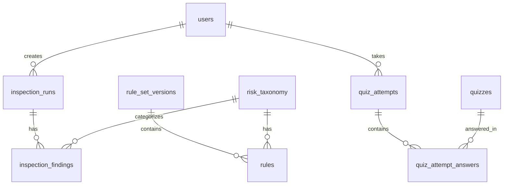

# AdSafe 기술 명세서 (Technical Specification)

**버전**: MVP 1.0 | **최종 수정**: 2026-02-05

---

## 1. 기술 스택

| 레이어 | 기술 |
|--------|------|
| Frontend | HTML5, CSS3, JavaScript (ES6+), Bootstrap 5 |
| Backend | PHP 8.x, Apache (XAMPP) |
| Database | MySQL 8.x (Aiven Cloud) |
| 개발 환경 | XAMPP, ngrok (터널링) |

---

## 2. 시스템 아키텍처

```
┌─────────────────────────────────────────────────────────┐
│                    Browser (Client)                      │
│   HTML Pages + JavaScript (auth.js, main.js)            │
└────────────────────────┬────────────────────────────────┘
                         │ HTTP REST API (JSON)
                         ▼
┌─────────────────────────────────────────────────────────┐
│                 Apache + PHP 8.x                         │
│  ┌─────────────────────────────────────────────────┐    │
│  │  api/                                            │    │
│  │  ├─ index.php (진입점)                           │    │
│  │  ├─ routes.php (라우팅)                          │    │
│  │  ├─ handlers/ (컨트롤러)                         │    │
│  │  ├─ engine/inspection_engine.php (검수 엔진)    │    │
│  │  └─ lib/bootstrap.php (DB, CORS, 유틸)          │    │
│  └─────────────────────────────────────────────────┘    │
└────────────────────────┬────────────────────────────────┘
                         │ MySQL Protocol (PDO)
                         ▼
┌─────────────────────────────────────────────────────────┐
│              MySQL 8.x (Aiven Cloud)                     │
│   users, rules, inspection_runs, quizzes, ...           │
└─────────────────────────────────────────────────────────┘
```

---

## 3. 디렉토리 구조

```
AdSafe/
├── api/
│   ├── index.php              # API 진입점
│   ├── routes.php             # URL 라우팅
│   ├── handlers/
│   │   ├── auth.php           # 로그인
│   │   ├── users.php          # 사용자 CRUD
│   │   ├── inspect.php        # 검수 실행
│   │   ├── inspection_history.php
│   │   ├── rules.php          # 룰/버전 CRUD
│   │   ├── taxonomy.php       # 리스크 유형 CRUD
│   │   └── quiz.php           # 퀴즈/학습
│   ├── engine/
│   │   └── inspection_engine.php  # 룰 기반 검수
│   └── lib/
│       └── bootstrap.php      # DB 연결, CORS
├── admin/                     # 관리자 페이지
├── docs/                      # 문서
├── *.html                     # 사용자 페이지
├── main.js, auth.js           # 공통 스크립트
└── .env                       # 환경 변수
```

---

## 4. ERD (핵심 테이블)

### 4.1 테이블 관계도



### 4.2 테이블 관계 요약

| 부모 테이블 | 자식 테이블 | 관계 | FK 컬럼 |
|------------|------------|------|---------|
| `users` | `inspection_runs` | 1:N | created_by |
| `users` | `quiz_attempts` | 1:N | user_id |
| `risk_taxonomy` | `rules` | 1:N | risk_code |
| `risk_taxonomy` | `inspection_findings` | 1:N | risk_code |
| `rule_set_versions` | `rules` | 1:N | rule_set_version_id |
| `inspection_runs` | `inspection_findings` | 1:N | run_id |
| `quiz_attempts` | `quiz_attempt_answers` | 1:N | attempt_id |
| `quizzes` | `quiz_attempt_answers` | 1:N | quiz_id |

### 주요 테이블 설명

| 테이블 | 설명 |
|--------|------|
| `users` | 사용자 (email, role: admin/editor) |
| `risk_taxonomy` | 리스크 분류 체계 (코드, 대/중/소분류) |
| `rule_set_versions` | 룰셋 버전 (status: draft/active/inactive) |
| `rules` | 검수 룰 (keyword/regex 패턴) |
| `inspection_runs` | 검수 실행 이력 |
| `inspection_findings` | 적발 상세 |
| `quizzes` | 퀴즈 문제 |
| `quiz_attempts` | 퀴즈 시도 이력 |

---

## 5. API 명세

### 5.1 인증

| Method | Endpoint | 설명 |
|--------|----------|------|
| POST | `/api/auth/login` | 로그인 |
| POST | `/api/users` | 회원가입 |
| POST | `/api/users/withdraw` | 회원탈퇴 |

### 5.2 검수

| Method | Endpoint | 설명 |
|--------|----------|------|
| POST | `/api/inspect` | 검수 실행 |
| GET | `/api/inspection-history` | 이력 목록 |
| GET | `/api/inspection-history/:id` | 이력 상세 |

**검수 요청/응답 예시**:
```json
// Request
POST /api/inspect
{ "text": "100% 완치 보장", "project": "banner", "user_id": 1 }

// Response
{
  "summary": { "level": "high", "totalFindings": 1 },
  "findings": [{
    "riskCode": "RISK_GUARANTEE",
    "matchedText": "100% 완치 보장",
    "riskLevel": "high",
    "explanation": "치료 효과 보장 표현은 금지됩니다.",
    "suggestion": "효과 보장 표현을 삭제하세요."
  }]
}
```

### 5.3 학습

| Method | Endpoint | 설명 |
|--------|----------|------|
| GET | `/api/quizzes` | 랜덤 퀴즈 |
| GET | `/api/quizzes/wrong` | 틀린 문제 |
| POST | `/api/quiz-attempts` | 세션 시작 |
| POST | `/api/quiz-attempts/:id/submit` | 답안 제출 |
| GET | `/api/learning-progress` | 학습 현황 |

### 5.4 관리자

| Method | Endpoint | 설명 |
|--------|----------|------|
| GET/POST/PUT/DELETE | `/api/taxonomy` | 리스크 유형 CRUD |
| GET/POST/PUT/DELETE | `/api/rules` | 룰 CRUD |
| GET/POST/DELETE | `/api/rule-set-versions` | 버전 CRUD |
| PUT | `/api/rule-set-versions/:id/activate` | 활성화 |
| PUT | `/api/rule-set-versions/:id/deactivate` | 비활성화 |
| GET/PUT/DELETE | `/api/users` | 사용자 관리 |

---

## 6. 검수 엔진 로직

```php
// engine/inspection_engine.php 핵심 로직

1. 활성 룰셋 버전의 룰 로드
2. 각 룰에 대해:
   - keyword 타입: 쉼표 구분 키워드 매칭
   - regex 타입: 정규식 매칭
3. 매칭된 항목을 findings 배열에 추가
4. 최고 위험도를 summary.level로 설정
5. 결과 반환 + DB 저장
```

---

## 7. 보안

| 항목 | 구현 |
|------|------|
| 비밀번호 | `password_hash()` / `password_verify()` (bcrypt) |
| SQL Injection | PDO Prepared Statements |
| XSS | `htmlspecialchars()` 출력 이스케이프 |
| CORS | `lib/bootstrap.php`에서 헤더 설정 |

---

## 8. 환경 설정

### .env 파일
```
DB_HOST=mysql-xxx.aiven.io
DB_PORT=xxxxx
DB_NAME=adsafe_2
DB_USER=avnadmin
DB_PASS=xxxxx
```

### DB 마이그레이션 (필요 시)
```sql
-- 룰셋 버전 status에 'inactive' 추가
ALTER TABLE rule_set_versions 
MODIFY COLUMN status ENUM('draft','active','inactive','deprecated') DEFAULT 'draft';

-- inspection_runs에 ad_type, ad_title 추가
ALTER TABLE inspection_runs 
ADD COLUMN ad_type VARCHAR(50) DEFAULT NULL,
ADD COLUMN ad_title VARCHAR(255) DEFAULT NULL;
```

---

## 9. 변경 이력

| 날짜 | 내용 |
|------|------|
| 2026-02-05 | MVP 기술 명세 작성 |
