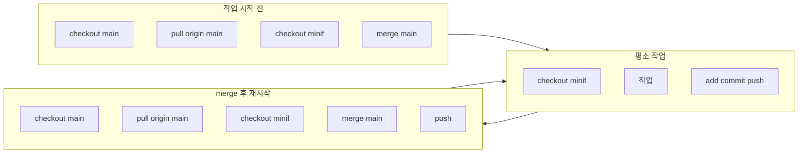

# vlackholism5 Git 워크플로우 가이드 (minif 브랜치)

저장소: `chloe6084/Adsafe`  
본인 브랜치: `minif`

---

## 시나리오 1: 작업 시작 전 (main 최신 반영)

**목적:** GitHub의 main 최신 상태를 가져와서, minif를 그 기준으로 맞춘 뒤 작업 시작.

```text
git checkout main
git pull origin main
git checkout minif
git merge main
```

이후 `minif`에서 작업 진행.

**간편 실행:** 프로젝트 루트에서 `scripts\sync-main-into-minif.cmd` 실행 (또는 더블클릭).

minif에서 **다시 main으로 돌아가려면:** `git checkout main`  
다시 minif로 오려면: `git checkout minif`

---

## 시나리오 2: 평소 작업 (커밋 & 푸시)

**목적:** minif에서 작업한 내용을 커밋하고 원격(minif)에 올림.  
(1번 스크립트는 "minif 준비"만 하고, **이 단계는 자동이 아니라 작업 후 직접 실행**합니다.)

```text
git checkout minif
# ... 에디터에서 파일 수정/작업 ...
git add .
git commit -m "커밋 메시지"
git push
```

`git push`만 해도 `origin minif`로 푸시됨 (이미 `-u origin minif` 설정됨).

---

## 시나리오 3: chloe6084가 main에 merge한 후, 다시 작업 시작할 때

**목적:** main에 반영된 내용을 minif에 가져온 뒤, 원격 minif도 갱신.

```text
git checkout main
git pull origin main
git checkout minif
git merge main
git push
```

마지막 `git push`로 merge된 minif를 GitHub에 반영.

**간편 실행:** 프로젝트 루트에서 `scripts\sync-main-and-push.cmd` 실행 (또는 더블클릭).

---

## 403 (Permission denied) 방지

push 시 `Permission to chloe6084/Adsafe.git denied` 가 나오면 인증 문제입니다.

- **HTTPS 사용 시**
  - Windows: 제어판 → 자격 증명 관리자 → Windows 자격 증명에서 `git:https://github.com` 확인/수정.
  - 또는 푸시 시 브라우저/팝업으로 로그인하거나, **Personal Access Token(PAT)**을 비밀번호 대신 사용.
- **SSH 사용 시**
  - `git remote set-url origin git@github.com:chloe6084/Adsafe.git` 로 변경 후, vlackholism5 계정의 SSH 키가 GitHub에 등록되어 있으면 403 없이 push 가능.

한 번 인증이 성공하면 같은 PC에서는 계속 작동합니다.

---

## 플로우 요약



---

minif 브랜치 워크플로우는 이 문서(`docs/git-workflow-vlackholism5.md`)를 참고하세요.
