# AdSafe DB ERD (Entity Relationship Diagram)

**ERD** = Entity Relationship Diagram (엔티티-관계 다이어그램)  
테이블(엔티티)과 그 사이의 관계(FK)를 나타낸 구조도입니다.

**스키마**: adsafe_2 | **DB**: MySQL 8.x (Aiven Cloud) | **테이블 수**: 19개

---

## 전체 ERD (Mermaid)

아래 코드는 [Mermaid](https://mermaid.js.org/) 문법입니다.  
GitHub, Cursor, VS Code(Mermaid 확장), 또는 [mermaid.live](https://mermaid.live)에서 렌더링할 수 있습니다.

```mermaid
erDiagram
  %% ============================================
  %% A. 어드민 / 계정 / 운영
  %% ============================================
  workspaces ||--o{ users : "workspace_id"
  workspaces ||--o{ invitations : "workspace_id"
  workspaces ||--o{ user_sessions : "workspace_id"
  workspaces ||--o{ audit_logs : "workspace_id"
  workspaces ||--o{ projects : "workspace_id"
  workspaces ||--o{ inspection_runs : "workspace_id"
  workspaces ||--o{ quizzes : "workspace_id"
  workspaces ||--o{ quiz_attempts : "workspace_id"
  workspaces ||--o{ learning_progress : "workspace_id"

  users ||--o{ invitations : "created_by"
  users ||--o{ user_sessions : "user_id"
  users ||--o{ audit_logs : "actor_user_id"
  users ||--o{ projects : "created_by"
  users ||--o{ ad_copies : "created_by"
  users ||--o{ copy_versions : "created_by"
  users ||--o{ inspection_runs : "created_by"
  users ||--o{ rule_set_versions : "created_by"
  users ||--o{ quiz_attempts : "user_id"
  users ||--o{ learning_progress : "user_id"

  %% ============================================
  %% B. 제작 모드 (프로젝트 / 문구)
  %% ============================================
  projects ||--o{ ad_copies : "project_id"
  ad_copies ||--o{ copy_versions : "copy_id"

  %% ============================================
  %% C. 룰엔진 / 검수
  %% ============================================
  risk_taxonomy ||--o{ rules : "risk_code"
  risk_taxonomy ||--o{ inspection_findings : "risk_code"
  risk_taxonomy ||--o| quizzes : "category_risk_code"
  risk_taxonomy ||--o{ learning_progress : "risk_code"

  rule_set_versions ||--o{ rules : "rule_set_version_id"
  rule_set_versions ||--o| inspection_runs : "rule_set_version_id"

  projects ||--o| inspection_runs : "project_id"
  ad_copies ||--o| inspection_runs : "copy_id"
  inspection_runs ||--o{ inspection_findings : "run_id"
  rules ||--o| inspection_findings : "rule_id"

  %% ============================================
  %% D. 교육 모드 (AduSafe)
  %% ============================================
  quizzes ||--o{ quiz_choices : "quiz_id"
  quizzes ||--o{ quiz_attempt_answers : "quiz_id"
  quiz_attempts ||--o{ quiz_attempt_answers : "attempt_id"

  %% ============================================
  %% 테이블 정의
  %% ============================================

  workspaces {
    bigint workspace_id PK "AUTO_INCREMENT"
    varchar name "조직명"
    enum plan "free|pro|team|enterprise"
    enum status "active|suspended"
    datetime created_at
    datetime updated_at
  }

  users {
    bigint user_id PK "AUTO_INCREMENT"
    bigint workspace_id FK "workspaces"
    varchar email UK "UNIQUE"
    varchar password_hash "bcrypt"
    varchar name "사용자명"
    enum role "owner|admin|editor|viewer"
    enum status "active|disabled"
    datetime last_login_at
    datetime created_at
    datetime updated_at
  }

  invitations {
    bigint invitation_id PK "AUTO_INCREMENT"
    bigint workspace_id FK "workspaces"
    varchar invited_email "초대 이메일"
    enum invited_role "admin|editor|viewer"
    char token UK "64자 고유 토큰"
    enum status "pending|accepted|revoked|expired"
    datetime expires_at
    bigint created_by FK "users"
    bigint accepted_by FK "users"
    datetime created_at
    datetime accepted_at
  }

  user_sessions {
    bigint session_id PK "AUTO_INCREMENT"
    bigint workspace_id FK "workspaces"
    bigint user_id FK "users"
    char session_token UK "64자"
    varchar ip "접속 IP"
    varchar user_agent "브라우저 정보"
    datetime created_at
    datetime expires_at
    datetime revoked_at
  }

  audit_logs {
    bigint audit_id PK "AUTO_INCREMENT"
    bigint workspace_id FK "workspaces"
    bigint actor_user_id FK "users (SET NULL)"
    varchar action "RULESET_ACTIVATED 등"
    varchar entity_type "rules|users 등"
    varchar entity_id "대상 ID"
    json meta_json "변경 상세"
    datetime created_at
  }

  projects {
    bigint project_id PK "AUTO_INCREMENT"
    bigint workspace_id FK "workspaces"
    varchar name "프로젝트명"
    enum industry "medical|health_supplement|general|other"
    enum channel "search|display|sns|landing|ooh|other"
    enum status "active|archived"
    bigint created_by FK "users"
    datetime created_at
    datetime updated_at
  }

  ad_copies {
    bigint copy_id PK "AUTO_INCREMENT"
    bigint project_id FK "projects"
    varchar title "문구 제목"
    text raw_text "원본 광고 문구"
    int current_version_no "현재 버전 번호"
    enum language "ko|en|jp|zh|other"
    enum status "draft|archived"
    bigint created_by FK "users"
    datetime created_at
    datetime updated_at
  }

  copy_versions {
    bigint copy_version_id PK "AUTO_INCREMENT"
    bigint copy_id FK "ad_copies"
    int version_no "버전 번호"
    text raw_text "해당 버전 문구"
    varchar change_note "수정 메모"
    bigint created_by FK "users"
    datetime created_at
  }

  risk_taxonomy {
    varchar risk_code PK "예: RISK_GUARANTEE_RESULT"
    varchar level_1 "대분류 (예: 효과보장)"
    varchar level_2 "중분류 (예: 완치보장)"
    varchar level_3 "판정단위 (예: 완치/해결 보장)"
    enum default_risk_level "low|medium|high"
    text description "설명"
    json examples "예시 문구"
    tinyint is_active "1=활성 0=비활성"
    datetime created_at
    datetime updated_at
  }

  rule_set_versions {
    bigint rule_set_version_id PK "AUTO_INCREMENT"
    varchar name "버전명 (예: v2.1.0)"
    enum industry "medical|health_supplement|general|other"
    enum status "draft|active|deprecated"
    text changelog "변경내역"
    bigint created_by FK "users"
    datetime created_at
    datetime activated_at "활성화 일시"
  }

  rules {
    bigint rule_id PK "AUTO_INCREMENT"
    bigint rule_set_version_id FK "rule_set_versions"
    varchar risk_code FK "risk_taxonomy"
    varchar rule_name "룰명"
    enum rule_type "keyword|regex|numeric|combo"
    text pattern "키워드 또는 정규식 패턴"
    json condition_json "추가 조건"
    enum severity_override "low|medium|high (NULL=기본)"
    text explanation_template "설명 템플릿"
    text suggestion_template "수정 가이드 템플릿"
    tinyint is_active "1=활성 0=비활성"
    datetime created_at
    datetime updated_at
  }

  inspection_runs {
    bigint run_id PK "AUTO_INCREMENT"
    bigint workspace_id FK "workspaces"
    bigint project_id FK "projects (NULL)"
    bigint copy_id FK "ad_copies (NULL)"
    int copy_version_no "문구 버전"
    bigint rule_set_version_id FK "rule_set_versions"
    enum risk_summary_level "none|low|medium|high"
    int total_findings "적발 건수"
    text normalized_text "전처리된 문구"
    int processing_ms "처리 시간(ms)"
    bigint created_by FK "users"
    datetime created_at "검수 실행 일시"
  }

  inspection_findings {
    bigint finding_id PK "AUTO_INCREMENT"
    bigint run_id FK "inspection_runs"
    varchar risk_code FK "risk_taxonomy"
    enum risk_level "low|medium|high"
    bigint rule_id FK "rules (NULL)"
    enum match_type "keyword|pattern|numeric_rule|combo"
    varchar matched_text "매칭된 표현"
    int start_idx "시작 위치"
    int end_idx "끝 위치"
    json evidence "매칭 증거"
    varchar explanation_title "설명 제목"
    text explanation_body "설명 본문"
    text suggestion "수정 가이드"
    datetime created_at
  }

  normalization_profiles {
    bigint norm_profile_id PK "AUTO_INCREMENT"
    varchar name "프로필명"
    json config_json "전처리 설정"
    datetime created_at
  }

  quizzes {
    bigint quiz_id PK "AUTO_INCREMENT"
    bigint workspace_id FK "workspaces"
    varchar category_risk_code FK "risk_taxonomy (NULL)"
    enum difficulty "easy|normal|hard"
    text question "문제 지문"
    text explanation "해설"
    varchar source_ref "출처/근거"
    tinyint is_active "1=활성 0=비활성"
    datetime created_at
    datetime updated_at
  }

  quiz_choices {
    bigint choice_id PK "AUTO_INCREMENT"
    bigint quiz_id FK "quizzes"
    tinyint choice_no "0~3 (4지선다)"
    text choice_text "보기 텍스트"
    tinyint is_correct "1=정답 0=오답"
  }

  quiz_attempts {
    bigint attempt_id PK "AUTO_INCREMENT"
    bigint user_id FK "users"
    bigint workspace_id FK "workspaces"
    datetime started_at "시작 시각"
    datetime finished_at "완료 시각 (NULL=진행중)"
    int total_questions "총 문제 수"
    int correct_count "정답 수"
  }

  quiz_attempt_answers {
    bigint attempt_answer_id PK "AUTO_INCREMENT"
    bigint attempt_id FK "quiz_attempts"
    bigint quiz_id FK "quizzes"
    tinyint selected_choice_no "선택한 보기 번호"
    tinyint is_correct "1=정답 0=오답"
    datetime answered_at "답변 시각"
  }

  learning_progress {
    bigint progress_id PK "AUTO_INCREMENT"
    bigint user_id FK "users"
    bigint workspace_id FK "workspaces"
    varchar risk_code FK "risk_taxonomy"
    int total_attempts "총 시도 수"
    int correct_attempts "정답 수"
    decimal mastery_score "숙련도 점수"
    datetime updated_at
  }
```



---

## 영역별 테이블 관계 요약

### A. 어드민 / 계정 (5개)

```
workspaces (조직)
  ├── users (사용자)
  ├── invitations (초대)
  ├── user_sessions (세션)
  └── audit_logs (감사 로그)
```

### B. 제작 모드 (3개)

```
projects (프로젝트)
  └── ad_copies (문구)
        └── copy_versions (문구 수정 이력)
```

### C. 룰엔진 / 검수 (6개)

```
risk_taxonomy (리스크 분류)    rule_set_versions (룰셋 버전)
       │                              │
       └──────── rules (룰) ──────────┘
                    │
inspection_runs (검수 실행) ←── users, projects, ad_copies
       │
inspection_findings (적발 항목) ←── risk_taxonomy, rules
       
normalization_profiles (전처리 프로필)
```

### D. 교육 모드 (5개)

```
quizzes (문제) ←── risk_taxonomy
  └── quiz_choices (보기 4개)

quiz_attempts (풀이 세션) ←── users
  └── quiz_attempt_answers (답안) ←── quizzes

learning_progress (숙련도) ←── users, risk_taxonomy
```

---

## FK 관계 전체 목록

| 자식 테이블 | FK 컬럼 | 부모 테이블 | 삭제 시 |
|------------|---------|-----------|---------|
| `users` | workspace_id | `workspaces` | CASCADE |
| `invitations` | workspace_id | `workspaces` | CASCADE |
| `invitations` | created_by | `users` | SET NULL |
| `invitations` | accepted_by | `users` | SET NULL |
| `user_sessions` | workspace_id | `workspaces` | CASCADE |
| `user_sessions` | user_id | `users` | CASCADE |
| `audit_logs` | workspace_id | `workspaces` | CASCADE |
| `audit_logs` | actor_user_id | `users` | SET NULL |
| `projects` | workspace_id | `workspaces` | CASCADE |
| `projects` | created_by | `users` | SET NULL |
| `ad_copies` | project_id | `projects` | CASCADE |
| `ad_copies` | created_by | `users` | SET NULL |
| `copy_versions` | copy_id | `ad_copies` | CASCADE |
| `copy_versions` | created_by | `users` | SET NULL |
| `rules` | rule_set_version_id | `rule_set_versions` | CASCADE |
| `rules` | risk_code | `risk_taxonomy` | RESTRICT |
| `rule_set_versions` | created_by | `users` | SET NULL |
| `inspection_runs` | workspace_id | `workspaces` | CASCADE |
| `inspection_runs` | project_id | `projects` | SET NULL |
| `inspection_runs` | copy_id | `ad_copies` | SET NULL |
| `inspection_runs` | rule_set_version_id | `rule_set_versions` | SET NULL |
| `inspection_runs` | created_by | `users` | SET NULL |
| `inspection_findings` | run_id | `inspection_runs` | CASCADE |
| `inspection_findings` | risk_code | `risk_taxonomy` | RESTRICT |
| `inspection_findings` | rule_id | `rules` | SET NULL |
| `quizzes` | workspace_id | `workspaces` | CASCADE |
| `quizzes` | category_risk_code | `risk_taxonomy` | SET NULL |
| `quiz_choices` | quiz_id | `quizzes` | CASCADE |
| `quiz_attempts` | user_id | `users` | CASCADE |
| `quiz_attempts` | workspace_id | `workspaces` | CASCADE |
| `quiz_attempt_answers` | attempt_id | `quiz_attempts` | CASCADE |
| `quiz_attempt_answers` | quiz_id | `quizzes` | CASCADE |
| `learning_progress` | user_id | `users` | CASCADE |
| `learning_progress` | workspace_id | `workspaces` | CASCADE |
| `learning_progress` | risk_code | `risk_taxonomy` | CASCADE |

---

## 검수하기 버튼과 연결된 테이블 (핵심 흐름)

```
[광고 문구 입력] → POST /api/inspect
                        │
           ┌────────────┴────────────┐
           ▼                         ▼
   inspection_runs             inspection_findings
   (검수 실행 1건)              (적발 항목 N건)
   ├─ run_id (PK)              ├─ finding_id (PK)
   ├─ risk_summary_level       ├─ run_id (FK)
   ├─ total_findings           ├─ risk_code (FK)
   ├─ normalized_text          ├─ matched_text
   ├─ created_by (FK→users)    ├─ explanation_body
   └─ created_at               └─ suggestion
```

---

## 테이블 목록 (총 19개)

| 영역 | 테이블 | 설명 |
|------|--------|------|
| **A. 어드민** | workspaces | 조직(테넌트) |
| | users | 사용자 계정 |
| | invitations | 초대 관리 |
| | user_sessions | 로그인 세션 |
| | audit_logs | 감사 로그 |
| **B. 제작** | projects | 프로젝트 |
| | ad_copies | 광고 문구 |
| | copy_versions | 문구 수정 이력 |
| **C. 룰/검수** | risk_taxonomy | 리스크 분류 체계 |
| | rule_set_versions | 룰셋 버전 |
| | rules | 검수 룰 (keyword/regex) |
| | inspection_runs | 검수 실행 이력 |
| | inspection_findings | 적발 상세 |
| | normalization_profiles | 전처리 프로필 |
| **D. 교육** | quizzes | 문제 은행 |
| | quiz_choices | 보기 (4지선다) |
| | quiz_attempts | 풀이 세션 |
| | quiz_attempt_answers | 답안 기록 |
| | learning_progress | 카테고리별 숙련도 |
